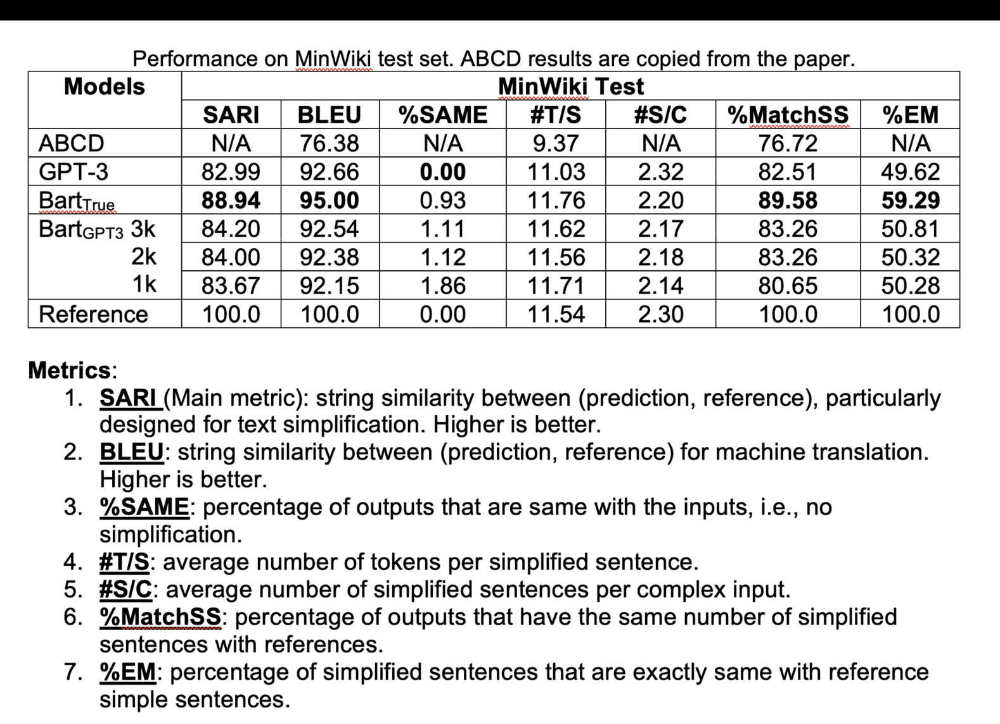

# Sentence Simplification

The goal of this task is to simplify a complex sentence to multiple simple sentences while keeping its meaning unchanged. 
Here we mainly consider "splitting", though simplification can involve several other operations such as lexical substitution, compression, elaboration, ect.

We first use GPT-3 to generate high-quality simplifications (`gpt3.py`) and then fine-tune a BART model (`models.py`) based on GPT-3 outputs.

We have experimented on two datasets: Manifesto and MinWiki. Original data and simplified outputs can be downloaded here https://drive.google.com/file/d/1qyqmIa4--gyh4VubvfsztJTzmKPvlWXj/view?usp=share_link.. 

## Preliminary Results

The evaluation codes can be found in `evaluator.py`.

BART + GPT-3 performs quite well on MinWiki dataset, but it's possibly because MinWiki dataset is easy. 
When we apply the method to Manifesto, we found the fine-tuned BART is conservative - only partial sentences are simplified while others are just copied. 
